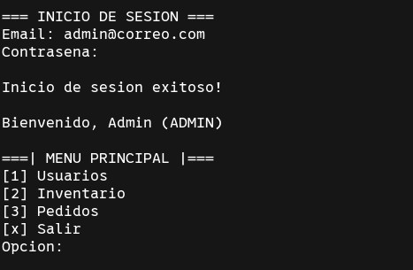
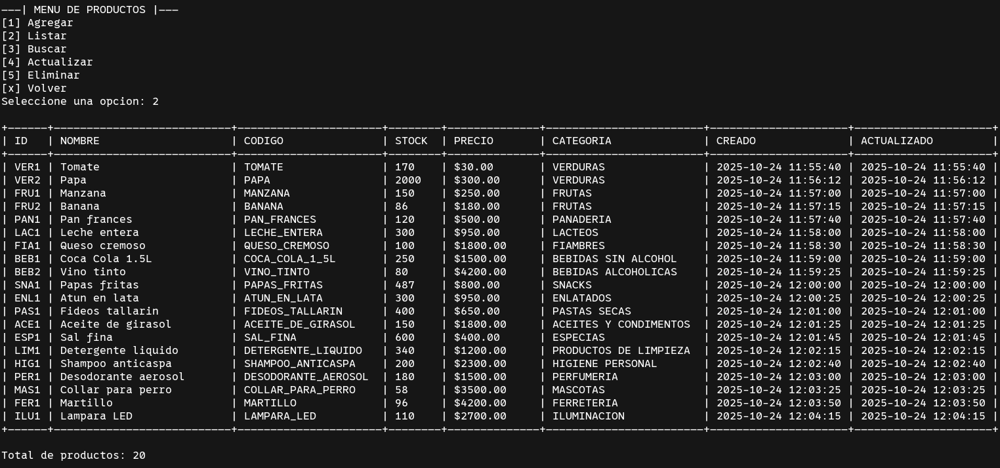
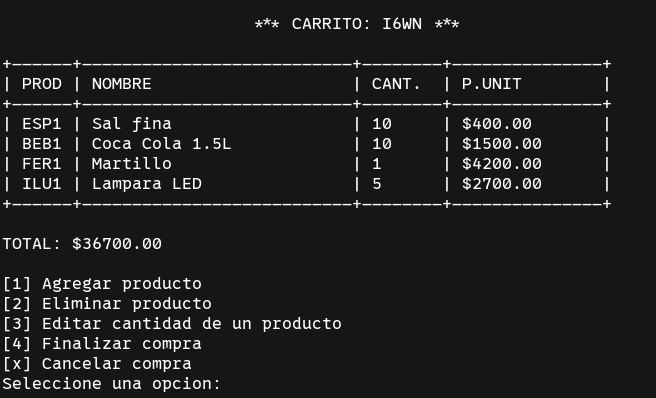

# 🛒 Sistema de Gestión de Ventas

**Proyecto integrador** de la asignatura **Algoritmos y Estructuras de Datos II**
Facultad UNNE - FaCENA

| Lenguaje                                                                                  | Licencia                                                                      | Repositorio                                                                                              |
| ----------------------------------------------------------------------------------------- | ----------------------------------------------------------------------------- | -------------------------------------------------------------------------------------------------------- |
|  |  |  |

---

## 🔍 Descripción

Este proyecto desarrolla un **sistema modular en C** para la **gestión de usuarios, inventario y ventas**, con enfoque en eficiencia y modularidad.

**Características principales:**

* Principios de **abstracción** y **modularidad**
* Uso de **estructuras dinámicas** como **listas enlazadas**
* Persistencia con **archivos `.txt` y `.csv`**
* **Algoritmos de búsqueda** optimizados
* **Aplicación de línea de comandos**, ideal para entornos de bajos recursos


---

## 🛠 Tecnologías utilizadas

| Categoría            | Tecnologías                                                                                                                                                                         |
| -------------------- | ----------------------------------------------------------------------------------------------------------------------------------------------------------------------------------- |
| Lenguaje             |                                                                                                     |
| Datos                |                                                                                             |
| Persistencia         |                                                                                                   |
| Compilación          |   |
| Control de versiones |   |                                                                                      |
| Algoritmos           |                                                         |
| Flujo de trabajo     |  |

---


## 💻 Instalación y ejecución

### Windows

```bash
# Opción 1: Ejecutar el build
sistema_gestion_ventas.exe

# Opción 2: Usar Makefile
make clean
make
make run
```

### Linux / MacOS

```bash
make clean
make
make run
```

---

## 🖱 Uso

*(Aquí se incluyen capturas de pantalla y GIFs del sistema en acción)*

| Función           | Imagen / GIF de ejemplo                      |
| ----------------- | -------------------------------------------- |
| Menú principal    |      |
| Inventario        |         |
| Carrito           |            |
| Ejemplo animado   |            |
| Ejemplo animado 2 |         |

---

## 👤 Usuarios de prueba

| Rol               | Correo                  | Contraseña |
|-------------------|-------------------------|------------|
| ADMIN             | admin@correo.com        | admin123   |
| INVENTORY_MANAGER | juan.perez@correo.com   | pass123    |
| CASHIER           | maria.gomez@correo.com  | pass456    |
| CLIENT            | carlos.ruiz@correo.com  | pass789    |

---

## 📊 Estado del proyecto

* ✅ Proyecto **académico finalizado y funcional**
* ⚡ Optimizado para **entornos de bajos recursos**
* 📁 Modular y fácil de mantener

---

## 📄 Licencia

* Este proyecto está bajo **Licencia GNU**


---

## 👥 Créditos

**Integrantes del grupo:**

| Nombre                        | Rol                        |
| ----------------------------- | -------------------------- |
| Schugurensky Leandro Daniel   | Líder de Desarrollo        |
| Rodriguez Rivas Milton Nahuel | Desarrollo y Documentacion |
| Salguero Benjamin             | Testing                    |

**Facultad / Carrera:**

* Facultad de Ciencias Exactas, Naturales y Agrimensura (FaCENA), UNNE
* Licenciatura en Sistemas de Información

**Materia:** Algoritmos y Estructuras de Datos II

---
